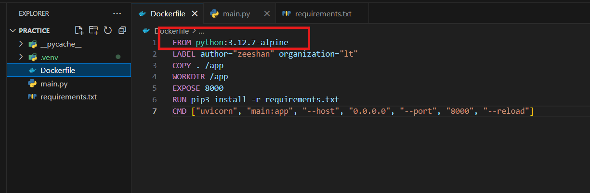

# Docker Fast API 

* For building the fastapi we need to have python code 
* Create a github Repo
*   - Clone into command line 
*   - Clone into your Ubuntu machine via docker install in it.
* After cloning it, write the code 
     - create files, 
     -              main.py 
     -              requirements.txt
     -              Dockerfile
* These files will be present in my github account name ="API"

* In command line we have check weather our fastapi is working or not, to check that  

* After running it on command line, we have to check it on internet for checking that, "127.0.0.1/docs"

## Lets run it on ubuntu docker machine

* Create one Ec2 instance, then install Docker in it
* git Clone the above manual build fastapi into Ec2 instance
* Then Pull the image 
* 
* Build the image, give access to the Port. 
* 
* Now check it will be running on your internet 
*   http://<ipaddress>:PortNumber/docs
 

Therefore, it executes
 

 